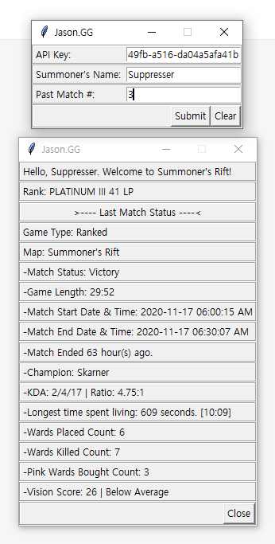

# RiotAPI
League of Legends, game developed by Riot Games. Practice API.

Used Tkinter module to create GUI where user can enter in API key, user id, and previous match number to pull game data from Riot API.

